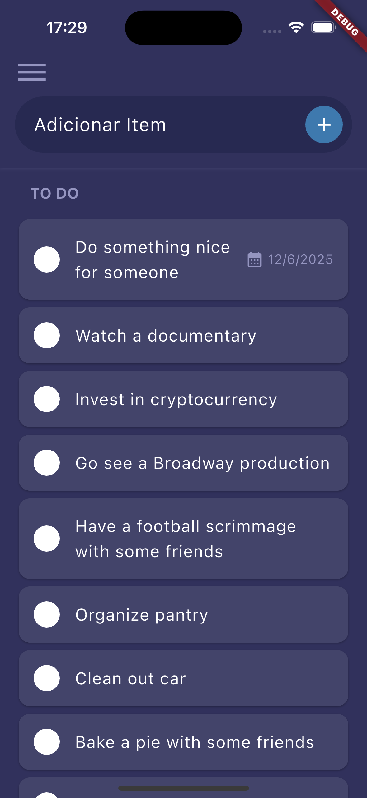
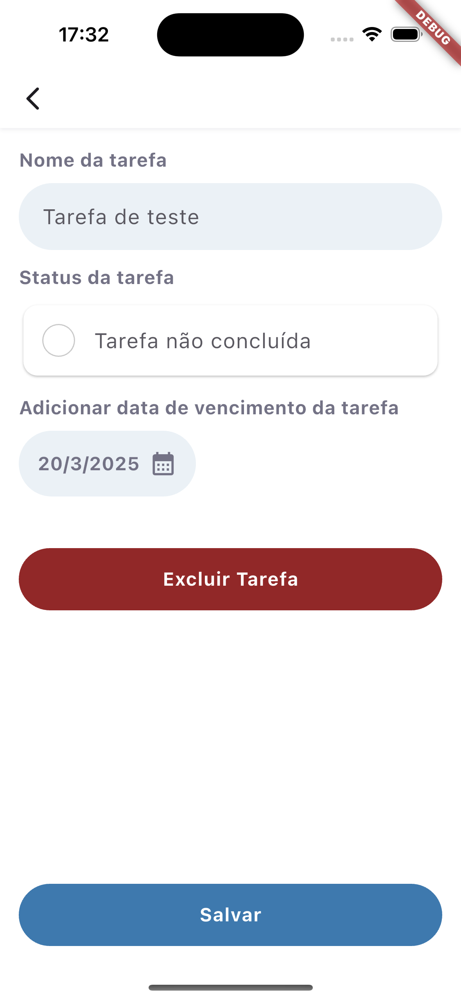

# 📱 To-Do List App

Um aplicativo de lista de tarefas desenvolvido em Flutter, com o objetivo de demonstrar minhas habilidades no desenvolvimento de aplicativos na prática. Este projeto foi implementado da melhor forma possível dentro do tempo disponível e de acordo com a proposta do desafio técnico.

## 📸 Screenshots

Aqui estão algumas capturas de tela do aplicativo:

  
  

## ⚙️ Execução do App

Na aba *Debug* do VS Code, há um arquivo de configuração para executar o aplicativo em três modos:  
- **Debug Mode**  
- **Profile Mode**  
- **Release Mode**  

## 🚀 Funcionalidades

- ✅ Adicionar uma tarefa  
- ✅ Marcar como concluída  
- ✅ Editar uma tarefa  
- ✅ Adicionar uma data de finalização  
- ✅ Remover a data de finalização
- ✅ Deletar uma tarefa  

## 🛠️ Tecnologias e Padrões Utilizados

- **Dio** – Para realizar requisições HTTP  
- **GetIt** – Para gerenciamento de injeção de dependências  
- **Mocktail** – Para testes de unidade  
- **App Architecture** – Padrão de arquitetura recomendado pela equipe do Flutter  
- **Result** – Para trabalhar com múltiplos retornos  
- **State Pattern com ValueNotifier** – Para gerenciamento de estados das telas  
- **ThemeExtension** – Para suportar temas claro e escuro  
- **Singleton** – Para armazenar a lista de tarefas e suas alterações durante a execução do app  
- **Failures** – Interface criada para definir erros específicos, proporcionando mais clareza sobre as falhas no aplicativo
- **Testes de Unidade** - Os testes validam a lógica de negócios, como a adição, edição, remoção e conclusão de tarefas, além do tratamento de erros e estados.  

## 🔧 Melhorias Futuras

Se tivesse mais tempo, eu implementaria:  

- **Armazenamento local** para salvar a lista de tarefas  
- **Sistema de notificações** para lembrar o usuário quando uma tarefa estiver próxima da data de finalização  
- **Internacionalização** para melhorar a organização e facilitar a manutenção e adição de novos textos no app  

---
